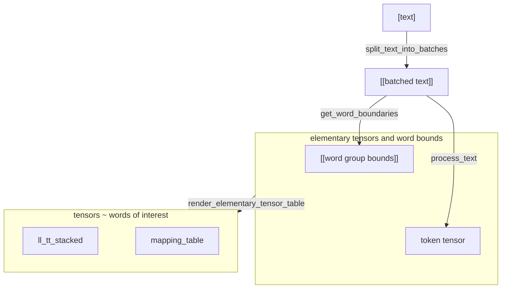

# PELinker

A service for entity linking of properties

## Developer notes

1. Make sure there is an available version of python specified in `pyproject.toml`, for example installed using pyenv.
2. Install `uv` : `curl -LsSf https://astral.sh/uv/install.sh | sh`
3. Run `uv sync --all-groups` to create a local environment with project dependencies specified in `uv.lock`
4. Add a spacy language model `uv run spacy download en_core_web_trf`
5. Set up `pre-commit` hooks:  `uv run pre-commit install`.
6. To run `pre-commit` independently from `git commit`, run `uv run pre-commit run --all-files`
7. To run tests run `pytest test`


NB.
1. To run python scripts prefix the command with `uv run`, e.g. `uv run python script.py`
2. To git commit also `uv run` prefix, e.g. `uv run git commit -m "first commit"` to make sure `pre-commit` hooks are used from the correct python environement. 


## Data Preparation
- `run/preprocessing/extract_properties_ro`
- `run/preprocessing/extract_properties_go`

### Merge properties/relations into a table

Uniformize and trim data incoming from different sources
 
- `run/preprocessing/merge_properties`

## Testing against ground truth

Ground truth dataset is stored in `data/ground_truth`, so run the following to obtain the accuracy of the model in `./reports` 

```commandline
python run/testing/run_pel_test.py --text-path ./data/ground_truth/sample.0.gt.json --model-type biobert-stsb --layers-spec sent --extra-context
```

## Serialize Model

"Train" a model on a corpus


- `poetry run python run/save_model.py`

### Run server

- `poetry run python run/serve`

## Container
1. Build image: `docker buildx build -t gg/pelinker:<current_version> --ssh default=$SSH_AUTH_SOCK . 2>&1 | tee build.log`
2. Run container: `docker run --name pelinker --env THR_SCORE=0.5 gg/pelinker:latest`


### Algo flow



[](https://mermaid.live/edit#pako:eNqNUj1vwyAU_CuIORnS0UOlJmmndmk6NY4QNs82CgYEz0qjJP7tfdjOx9ChTPi4O-6eOfHSKeAZr4w7lI0MyL7WuWW0XrY53yL84C7nOzafP59zHr3RKBIotEUnCollAzHnZ7ZM9O0IKDboknD0il1RB-kbtlkQDQy0YFGGI_FsdCEyaRU7uKBY4Tqr4k2YltIBStTOsvfPO7pifd-zKStYldtxu5yi1oAiOYrBUQY9xlwNMYer6uA6P134kPVq4IMrIcahbVKuSYluD3YK_Ue5p0SZGvVDn8hcxWhUECDiP1q9koMxAlFElOUeVJp9KvpGB630XttaoCwM3Mweum8WU_ZAIARxH7QYY12lZ8rKZ7yF0Eqt6PefkgGFb0iQ84y2CirZGcqc2wtRZYduc7QlzzB0MOOdVxJhrSVVb3lWSRMJ9dJ-O3f_BqXRhY_xiQ0vbcZp6nUzMS6_rEDWAA)


## Analysis

An essential part of analysis is to identify patterns in text and study their embeddings vectors.

To run pattern matching over different models and patterns, and plot them to `figs` folder, where the texts are taken from a csv file with a column named `abstract`:
```shell
cd run
./test.pat.align.sh ./test.pat.align.sh --pattern pat_a --pattern pat_b --plot-path figs --input-path data/test/sample.csv.gz
```
