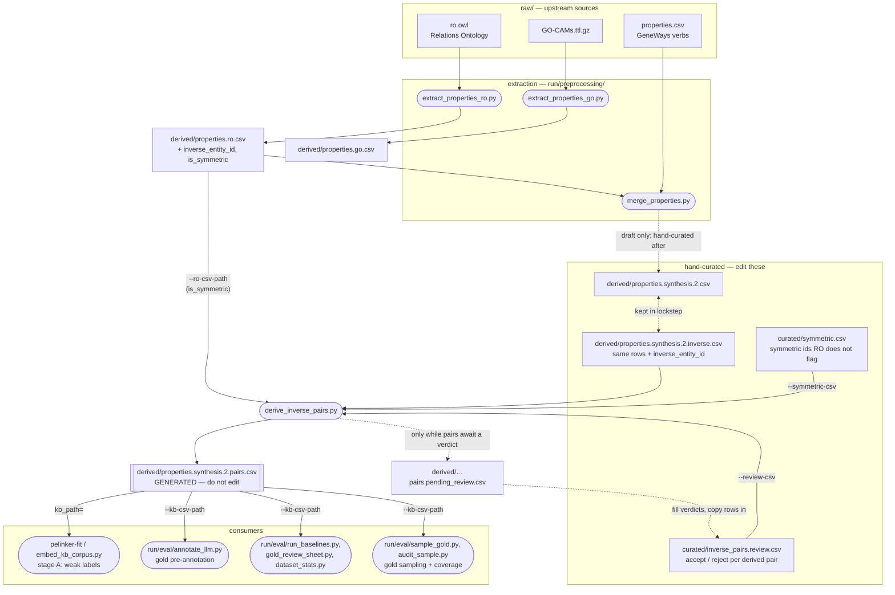

# Property KB: where each file comes from

The linker, the gold annotation and the scoring all read one property vocabulary (the KB).
This page covers which files are sources, which are hand-curated, which are generated, and
what to re-run after an edit.

**Rule of thumb:** edit only the **curated** files. The pairs KB
(`derived/properties.synthesis.2.pairs.csv`) is always *generated*, so never edit it by
hand. Re-run `derive_inverse_pairs.py` after any curated edit.



## Files

| File | Kind | What it holds |
|---|---|---|
| `raw/ro.owl`, `raw/GO-CAMs.ttl.gz`, `raw/properties.csv` | source | Upstream ontologies and the GeneWays verb list. Never edited. |
| `derived/properties.ro.csv` | generated (`extract_properties_ro.py`) | Every RO object property, its declared `owl:inverseOf` and `is_symmetric`. A property is symmetric when RO declares `owl:SymmetricProperty` or defines it by the chain `inverse(P) ∘ P`. |
| `derived/properties.synthesis.2.csv` | **curated** | The vocabulary: `entity_id,label,description,example`. `merge_properties.py` produced the first draft; the current file is hand-curated and the script does not reproduce it. Uses CRLF line endings, so keep them when editing. |
| `derived/properties.synthesis.2.inverse.csv` | **curated** | The same rows in the same order, plus `inverse_entity_id` for declared RO inverses. It is the input to the pair derivation. Any row added, removed or relabelled in `synthesis.2.csv` must be changed here too. |
| `curated/inverse_pairs.review.csv` | **curated** | Verdicts on converse pairs found by surface rules: `accept` keeps the pair; `reject` unlinks it, so each member becomes its own canonical form. Keyed on the unordered id pair. Rows with no verdict count as unreviewed. |
| `curated/symmetric.csv` | **curated** | Extra symmetric ids for entries RO does not flag (GeneWays and PEL verbs). Added to RO's flags. The derivation refuses an id that is not in the KB. |
| `derived/properties.synthesis.2.pairs.csv` | **generated** (`derive_inverse_pairs.py`) | The KB every consumer reads. Adds `inverse_entity_id`, `inverse_label`, `inverse_source`, `needs_review`, `is_symmetric`, `is_canonical`, `canonical_entity_id`. |
| `derived/properties.synthesis.2.pairs.pending_review.csv` | generated | Pairs still awaiting a verdict. Deleted automatically once none are left. |
| `derived/properties.synthesis.{0,1}.csv`, `*.diverse.csv`, `selected_verbial_props_0.csv` | legacy / derived variants | Older vocabulary versions and entity subsets. Not read by the gold pipeline. |
| `ground_truth/`, `test/` | fixtures | Test and sample data. |

## What the pair derivation does

`run/preprocessing/derive_inverse_pairs.py` reads the four inputs in the diagram and, for
every KB row:

1. **Symmetry.** Sets `is_symmetric` from RO's flag or the curated list. A symmetric
   relation reads the same from either end ("interacts with"), so it never gets a converse
   partner.
2. **Converse pairs.** Links each entry to its converse partner, recording the rule in
   `inverse_source`:
   - `ro`: a declared `owl:inverseOf`. Authoritative.
   - `has_of`: `has X` ↔ `X of`.
   - `passive_by`: `X-ed by` ↔ the active entry with the same verb lemma. Irregular
     participles count ("bound by" ↔ "binds to").
   - `passive_prep`: the same for other prepositions ("expressed in" ↔ "expresses").

   The last three are proposals and stay `needs_review` until the review sheet gives a
   verdict.
3. **Canonical member.** Elects one canonical member per pair: the active surface form
   ("regulates", not "regulated by"). Orientation then lives in a separate `direction`
   field (`forward`, `inverse`, `symmetric`, `na`), so a passive mention has exactly one
   encoding.

## Who reads the pairs KB, and why

- **Gold annotation** (`annotate_llm.py`) offers the model **canonical labels only**, with
  symmetric ones marked. A converse-form answer is folded onto its canonical id with the
  direction flipped.
- **Scoring** (`run_baselines.py`, the harness) compares ids in canonical space on both
  sides. A system that answers "regulated by" where gold says (`regulates`, inverse)
  picked the right relation.
- **Training, stage (A)** (`pelinker-fit kb_path=…pairs.csv`) labels each verb mention from
  the dependency parse, one label per mention, chosen by voice: "X is activated by Y" →
  `activated by`. Symmetric relations are never flipped. Pass the pairs KB rather than
  `synthesis.2.csv`, because the plain file carries no `is_symmetric`.

## Recipes

**Add or rename a relation.** Edit the row in both `synthesis.2.csv` and
`synthesis.2.inverse.csv`, keeping the same id and position, then run the derivation.
Mint new ids above the highest existing `PEL.*`.

**Review derived pairs.** Run the derivation. Copy the rows of `*.pending_review.csv` into
`curated/inverse_pairs.review.csv`, fill `verdict` (`accept` / `reject`) and add a `note` on
anything non-obvious. Then run the derivation again until nothing is pending.

**Mark a relation symmetric.** Add `entity_id,label,note` to `curated/symmetric.csv`, then
run the derivation. A symmetric entry loses any surface-rule pairing, so no reject verdict
is needed for it.

**Regenerate RO flags after updating `raw/ro.owl`.** `rdflib` is in the `preprocess`
extra:

```bash
uv run --with 'rdflib>=7.0' python run/preprocessing/extract_properties_ro.py
```

**Run the derivation.** The defaults point at the files above:

```bash
uv run python run/preprocessing/derive_inverse_pairs.py
```

Check the log: `Needing review: 0` means the pairs KB is ready to annotate against.

## What an edit invalidates

Any change that alters the canonical label list also changes the text of the annotation
prompt. That covers a label, a canonical member, a symmetric flag or a pair verdict.

- **LLM annotation cache:** misses for every document, so re-run `annotate_llm.py`.
  Existing `gold.*.json` files were built against the old KB.
- **Embedding parquets** from stage (A): their weak labels and `direction` were assigned
  against the old KB, so re-embed before re-selecting hyperparameters and fitting.
- **Scores** are comparable only between runs built on the same pairs KB.
