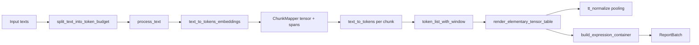

# Vector representations (`texts_to_vrep`)

This page describes the pipeline implemented by `texts_to_vrep` in `pelinker.util`: how raw strings become layer activations, how those align with spaCy token windows, and what objects you get back. Generated API entries live under **API Reference** (e.g. `pelinker.util`, `pelinker.onto`).

## Purpose

`texts_to_vrep` is the core batching path for **encoder-based mention/sentence vectors**: it runs the Hugging Face transformer once over all text chunks, aligns **subword token spans** from the tokenizer with **spaCy word-level windows** (`WordGrouping.W1`, `W2`, …), pools hidden states into one vector per window, and returns a `ReportBatch` you can index by grouping or pass to `embed_texts`.

## Data flow

### 1. Chunking (`split_text_into_token_budget`)

By default, each document is split with **`split_text_into_token_budget`**: segments are chosen so `len(tokenizer.encode(segment, add_special_tokens=False))` stays at or below `max_length` (interpreted as a **token** budget). A binary search on character offsets finds the longest prefix that fits, with a preference for breaking at the last space. Pass `chunk_by_token_budget=False` to `texts_to_vrep` to use the legacy **character** splitter `split_text_into_batches` instead.

### 2. Single forward pass (`process_text`)

All chunks from all documents are **flattened** and encoded in one call to `text_to_tokens_embeddings`. The result is a `ChunkMapper` carrying:

- Stacked hidden states: shape `(n_layers, n_chunks, seq_len, hidden)`.
- Per-chunk character `(start, end)` spans for each tokenizer token (empty spans removed).
- `it_ic`: maps flat chunk index → `(document_index, chunk_index_within_document)`.
- `cumulative_lens`: character offsets to map chunk-local spans back to document strings.

### 3. spaCy windows (`text_to_tokens`, `token_list_with_window`)

For each chunk string, spaCy produces `SimplifiedToken` records with character indices. `token_list_with_window` emits every contiguous window of length `w` (from `WordGrouping`) as an `Expression` with `a`/`b` character bounds in **chunk-local** coordinates.

### 4. Word span → token span → vectors (`render_elementary_tensor_table`)

For each `WordGrouping` pass, character spans `(a, b)` are turned into tokenizer token index ranges via `map_words_to_tokens` / `map_spans_to_spans_basic`. `tt_normalize` then:

1. Selects and averages the requested **layers** over the first dimension of the hidden-state tensor.
2. For each word span, **mean-pools** the token vectors inside that span.

The mapper’s `tt_expressions` list is filled with per-chunk tensors whose rows line up with these spans.

### 5. Filtering and document merge

Some windows may not map cleanly to tokenizer tokens; expressions whose start character `a` is not among surviving word starts are **dropped**. `build_expression_container` then **concatenates** chunks belonging to the same document so each `ExpressionHolder` matches the full original text index.

### 6. Multiple `word_modes`

The transformer is run **once**; the loop over `word_modes` only recomputes spaCy windows, span mapping, and pooling. Each mode yields a separate `ExpressionHolderBatch` inside the same `ReportBatch`.

## Relationship to sentence embeddings

`embed_texts` calls `texts_to_vrep` with a minimal window (`WordGrouping.W1`) and then uses `ReportBatch.get_text_embeddings`, which aggregates chunk-level vectors differently (`tt_aggregate_normalize`) for whole-text embeddings. That path reuses the same `ChunkMapper` tensor but is **not** identical to the per-window pooling inside `texts_to_vrep`.

## Implementation notes (current behavior)

- **Token-budget chunking** is the default; legacy character chunking remains available via `chunk_by_token_budget=False`.
- **`nlp`** is a required spaCy `Language` argument on `texts_to_vrep` and `embed_texts`.
- **spaCy** runs once per encoder chunk; results are reused for every `word_modes` entry.
- **`ChunkMapper` mutation** across `word_modes` is documented on the class; use `ReportBatch` for per-grouping data.
- **Dropped windows** (spaCy vs subword misalignment) are counted at debug log level.
- **Layer indices** are validated via `normalize_layers_spec` (string digits or negative indices, optional range check).
- **Hidden states** default to CPU; `keep_hidden_states_on_device=True` on `texts_to_vrep` keeps activations on the model device to reduce host RAM.

## See also

- **[Run scripts & CLIs](run_scripts_and_cli.md)** — training, server, and batch linking entry points.
- Generated module pages: **API Reference** → `pelinker.util`, `pelinker.onto`.
